# UI 渲染契约（presentationMeta / META_MARKER）v1

> 数据源：各工具 `--meta-json`（CLI 兼容）与 `META_MARKER` 内嵌 JSON（DSH 宿主通道，见 `fortune/cli.py:_dump_meta`）。
> 定位：插件仓库只负责**数据契约**与**渲染槽位定义**；GUI 渲染器在宿主（DSH harness）侧实施。

## 0. 三条铁律（与插件原则一致）

1. **信息零增量**：UI 只展示 meta 中已存在的结构化事实；任何组件必须有纯 Markdown 回退，且回退文本与组件内容逐字一致。
2. **动效不承载信息**：全部信息在文本/数据中；动画仅装饰（透明度/位移/高度，≤300ms，ease-out，`prefers-reduced-motion` 全降级瞬时，可全局关闭）。
3. **口径透明**：所有可切换口径（真太阳/钟表、神煞基准、铜钱约定、用神流派）由**后端预计算**全部结果，前端切换零计算，保证客观一致。

## 1. 各工具渲染槽位清单

> 标注 ✅=meta 已提供（本次改造补齐）；标 ⚠=此前仅存在于文本输出、**没有独立渲染位置**（本次改造后 meta 已补齐并指定槽位）。

### 1.1 八字 bazi（meta：`tool="bazi"`）

| 槽位 | 组件 | 数据字段 | 说明 |
|---|---|---|---|
| 四柱表 | 表格 | `chart.pillars` | 现状已有 |
| 五行条 | SVG | `strength.scores`（`report/svg.wuxing_bar_svg`） | 已有 SVG 生成器 |
| 旺衰计分明细 ⚠ | `
` 折叠块 | `strength.detail` | **此前只算不展示**；现在报告与 meta 双通道 |
| 何知章成对条 ⚠ | 双条件并排条 + 得分条形 | `hezhi_pairs[].items[].matched/reason`、`hezhi_thresholds` | 4 维成对（财/官/喜忌/元神），同维两条件并排 |
| 岁运变化表 | 表格（只报变化） | `hezhi_dayun[].delta` | 无变化时单行提示 |
| 流年时间轴 ⚠ | 横向年历 | `liunian[]`（year/gan_zhi/shi_shen/facts/dayun）、`liunian_anchor` | 冲突年描边；当前年居中；点击展开事实卡 |
| 用神多流派 Tabs | 分段器 | `yongshen_all{}` | 每派一个 tab，含结论与引文 |
| 神煞表 | 表格 | `shensha[]` | 现状已有 |

### 1.2 称骨 chenggu（meta：`tool="chenggu"`）

| 槽位 | 组件 | 数据字段 | 说明 |
|---|---|---|---|
| 骨重拆解卡 ⚠ | 年/月/日/时四格 + 合计 | `year_qian/month_qian/day_qian/hour_qian/total_qian/total_str` | **此前仅文本**；现在可渲染为四格卡片 |
| 判词卡 ⚠ | 引用块 | `verdict` | 突出展示 |
| 口径行 | 徽标 | `caliber` | 真太阳/钟表口径声明 |

### 1.3 小六壬 xiaoliuren（meta：`tool="xiaoliuren"`）

| 槽位 | 组件 | 数据字段 | 说明 |
|---|---|---|---|
| 掌诀位置卡 ⚠ | 手指示意图（左手指节标注） | `finger`（手指+节位）、`palace` | **此前仅文本**；六宫位置表已存于 `fortune/misc/xiaoliuren.py:FINGER_POS` |
| 推演路径条 ⚠ | 三步箭头条 | `month_palace/day_palace/palace`（`path()`） | 月落→日落→时落 |
| 六宫信息卡 | 键值卡 | `info`（吉凶/五行/方位/神煞/主数/断语） | — |
| 口径行 | 徽标 | `caliber` | 钟表 vs 真太阳两版可切换（后端预计算） |

### 1.4 梅花易数 meihua（meta：`tool="meihua"`）

| 槽位 | 组件 | 数据字段 | 说明 |
|---|---|---|---|
| 卦符卡 ⚠ | 本卦/互卦/变卦三卦符（☰☱…）+ 动爻标记 | `upper/lower/hu_upper/hu_lower/bian_upper/bian_lower/moving_line` | 字段已备（含互变上下卦） |
| 体用条 ⚠ | 体卦↔用卦 + 生克箭头 | `ti_gua/yong_gua/relation/verdict`、`wuxing` | 色按五行，字符标注关系 |
| 卦爻辞折叠 | 折叠引用 | `zhouyi`（卦辞/爻辞/彖传/大象传） | — |
| 口径行 | 徽标 | `caliber` | — |

### 1.5 六爻 liuyao（meta：`tool="liuyao"`）

| 槽位 | 组件 | 数据字段 | 说明 |
|---|---|---|---|
| 卦象卡 | 六爻列表（自下而上）+ 动爻标记 | `lines[]`（no/gan_zhi/liu_qin/liu_shen/value/is_moving/bian_*） | 现状已有文本 |
| 用神聚焦卡 ⚠ | 高亮用神爻 + 事实列表 | `topic_focus`（文本）、`topic/question` | **新增**；按占题高亮对应六亲爻 |
| 口径行 | 徽标 | `coin_back`（背=阳/阴）、`date`（自动推导月建日辰） | — |

### 1.6 紫微 ziwei（meta：`tool="ziwei"`）

| 槽位 | 组件 | 数据字段 | 说明 |
|---|---|---|---|
| 十二宫盘 | SVG hover | `palaces_for_svg()`（已有生成器） | 悬停高亮宫与三方四正 |
| 大限滑块 ⚠ | 年龄滑块 | `palaces[].da_xian` | 拖动高亮对应大限宫，星曜淡入 |
| 格局复核卡 ⚠ | 列表 | `pattern_review[]`（星曜实际落宫 + 破格提示） | **新增**，展示性核对 |
| 解读速览卡 | 卡片（--interpret 时） | `interpret_glance` 文本 / `interpret` 标志 | 检索式、无推断 |

### 1.7 历法 solar_info（meta：`tool="solar_info"`）

| 槽位 | 组件 | 数据字段 | 说明 |
|---|---|---|---|
| 节气时间线 ⚠ | 横向时间轴（前后各 6 节气） | `jieqi[]` | 高亮距出生最近的节气边界 |

### 1.8 BirthContext（meta：`tool="context"`）

| 槽位 | 组件 | 数据字段 | 说明 |
|---|---|---|---|
| 口径声明块 ⚠ | 徽标组 | `context.steps/eight_char/time_zhi_clock/time_zhi_solar/true_solar_shift_min` | 所有排盘工具共用此块，位置固定 |

### 1.9 综合分析 comprehensive（meta：`tool="comprehensive"`）

| 槽位 | 组件 | 数据字段 | 说明 |
|---|---|---|---|
| 共识热力矩阵 ⚠ | 五行×流派色阶表 | `matrix/consensus` | 行=流派、列=五行，票数色阶 |
| 维度结论卡 | 卡片（按共识度排序） | `conclusions[]`（dim/text/score/evidence） | 证据链折叠（工具→字段→事实→出处） |
| 冲突清单 | 警示列表 | `conflicts[]` | 如实并列，不调和 |

## 2. 动效规范

- 属性白名单：opacity / transform:translate / height；时长 ≤300ms；缓动 ease-out；
- 一次性「呼吸高亮」≤1.2s（当前年/当前大限/落宫结果）；
- `prefers-reduced-motion: reduce` 时全部瞬时；设置项可全局关闭动效；
- 任何动画不得遮挡、替换或延迟文本内容出现。

## 3. 回退矩阵

| 环境 | 行为 |
|---|---|
| 支持 presentationMeta 的 GUI | 渲染 §1 组件 |
| 仅 Markdown 渲染器 | 显示各工具纯文本输出（与组件内容逐字一致） |
| 无 JS | 同上，`
` 折叠可原生展开 |

## 4. harness（DSH 宿主）侧实施清单

1. 工具 schema 暴露：`fortune_liuyao` 增 `topic/question/date`；`fortune_bazi` 增 `years/anchorYear/hezhiLegacy`；`fortune_ziwei` 增 `interpret`；`fortune_context`/`fortune_comprehensive` 新工具注册；misc 三工具增 `lng/tzHours/trueSolar` 与 `format=json`（透传 CLI）。
2. 渲染器按 §1 槽位实现组件；验收用「契约 + 样例 JSON」（每工具一份 `--meta-json` 样例）。
3. e2e 断言：Markdown 回退与组件内容逐字一致（抽样 3 条）；动效关闭后信息不缺失。

## 5. 实施状态（2026-08-29 更新）

- ✅ 数据侧全部就绪：`hezhi_pairs/liunian/yongshen_all/alternates(口径预计算)/topic_focus/pattern_review/interpret_glance/caliber/matrix/consensus/conclusions/conflicts`；
- ✅ 客户端渲染器（`plugin-client/lib/client.js`）已实现 §1 全部槽位组件 + `fortune_context`/`fortune_comprehensive` 两个新视图，`dsh.client.immediately=true` 随页加载；`test/smoke.mjs`（9 视图 + 共识矩阵/证据链断言）全绿；
- ✅ 宿主插件（`plugin/lib/index.js`）注册 9 工具（含 2 新工具）、bazi 口径预计算（真太阳时主结果 + 钟表时对照）、六爻 date/topic 转发；`test/tools.test.mjs` 19 项全绿；
- ⏳ DSH 运行实例：客户端 bundle 已被宿主 watcher 自动重建（manifest rev 已更新），**刷新页面即可生效**；`fortune_context`/`fortune_comprehensive` 两个新工具的注册属宿主侧，若会话工具列表未更新则需重启 `dsh web`。

## 6. 实机渲染截图（2026-08-30，来自 pic/ 目录，选取代表性视图）

> 截图均为实际 GUI 渲染效果（深色主题）；完整 16 张见 `pic/`。截图路径相对本文件（`../pic/<文件名>`）。
> 注意：`145539` 为指标改版后截图（覆盖度·方向一致双徽章）；`142310/142339/142420` 截于改版前（徽章为旧版「共识度（强共识）」），版面结构一致，仅徽章名与计数方式不同。

### 6.1 八字排盘（fortune_bazi）

**四柱 + 口径分段器 + 页签总览**（`141445`）：顶栏徽章（排盘时刻/真太阳时/大运顺逆起运）→ **口径分段器「真太阳时｜钟表时」**（宿主预计算双口径，切换零计算）→ 八个页签（四柱/五行/大运/神煞/关系/用神/何知章/流年）→ 四柱卡（日主高亮，点卡看藏干十神详情面板）。

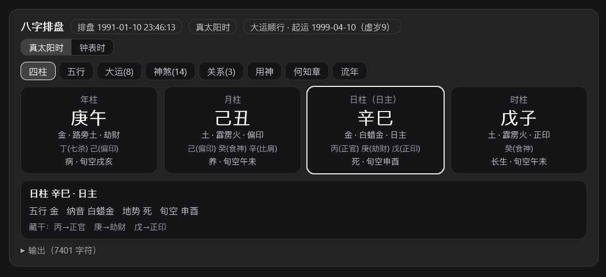

**五行旺衰条形图**（`141454`）：五行页签，长度按最大值归一 + 数值标注，逐条生长动画。

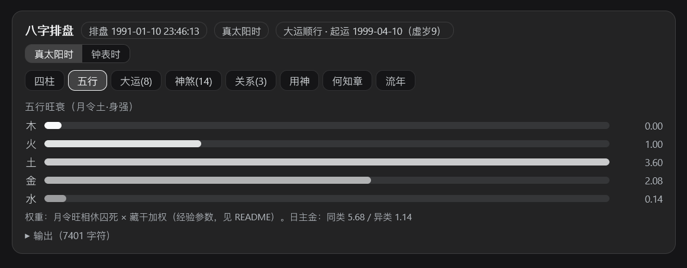

**用神·多流派子页签**（`141529`）：中文标签（旺衰/调候/通关/格局/病药），每派显示「用/忌」徽章与逐条结论（含《滴天髓》《穷通宝鉴》引文）。

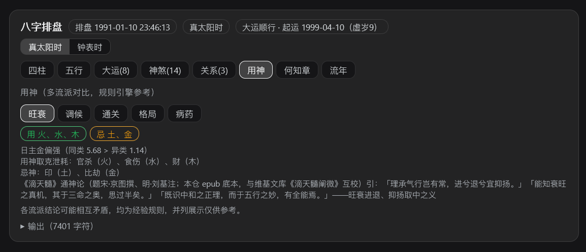

**何知章·4 维成对条**（`141536`）：财/官/喜忌/元神四维，同维两句并排，命中侧高亮描边并附得分/门槛依据。

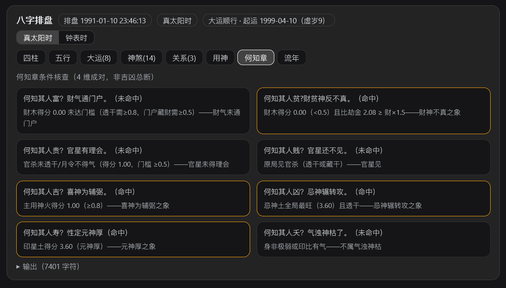

**大运流年时间轴**（`141543`）：横向年历（干支/十神/大运），冲突年（冲/刑/害/岁运并临等）描边，点选年份下方展开该年确定性关系事实面板。

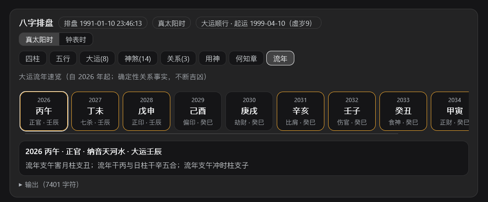

### 6.2 紫微斗数（fortune_ziwei）

**十二宫盘 + 格局复核 + 解读速览**（`142058`）：传统 4×4 宫格（命宫底色标识），选宫弹详情（主星/四化/大限/长生/辅星），下方依次为格局徽章、**格局复核**（星曜实际落宫提示）与**解读速览**（--interpret，检索式无推断）。

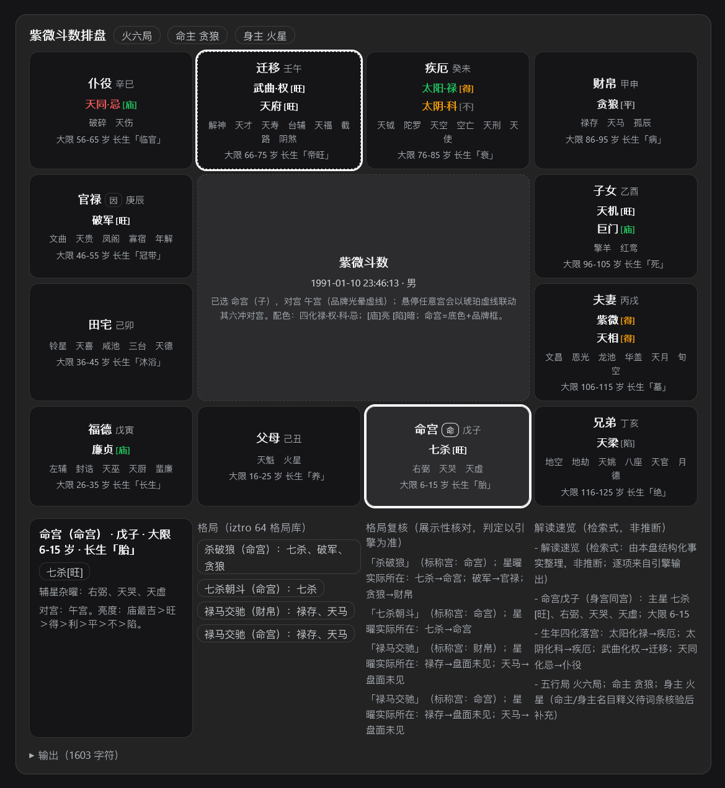

### 6.3 称骨 / 梅花 / 小六壬（fortune_misc）

**称骨**（`142219`）：年月日时四卡 + 总骨重弹入（「↻ 重播动效」按钮）+ 判词引用块 + **口径徽章**（真太阳时支，与八字/紫微一致）。

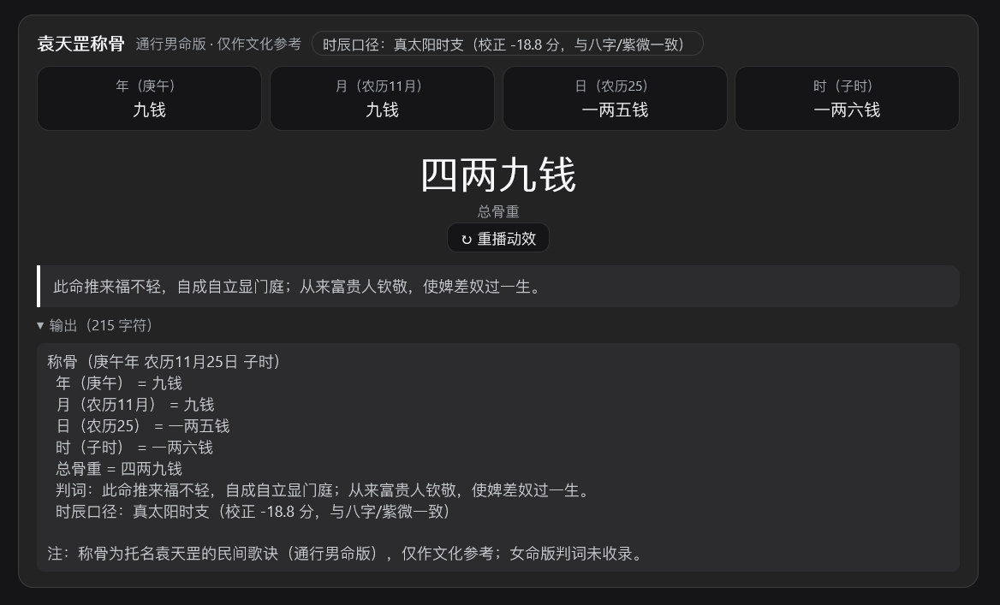

**梅花易数**（`142820`）：本卦/互卦/变卦三卡（卦符+卦名），点卡看上下卦爻位/先天数/五行详情；体用徽章（用生体 绿色）+ 断语块。

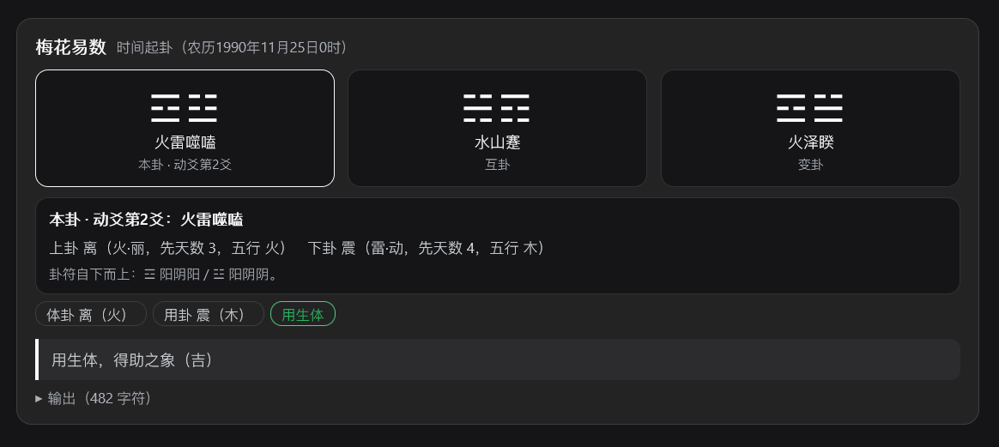

**小六壬**（`142835`）：「▶ 逐步推演」三步路径（月→日→时）+ 结果宫大卡（吉凶/五行/方位/神煞/主数）+ 断语。

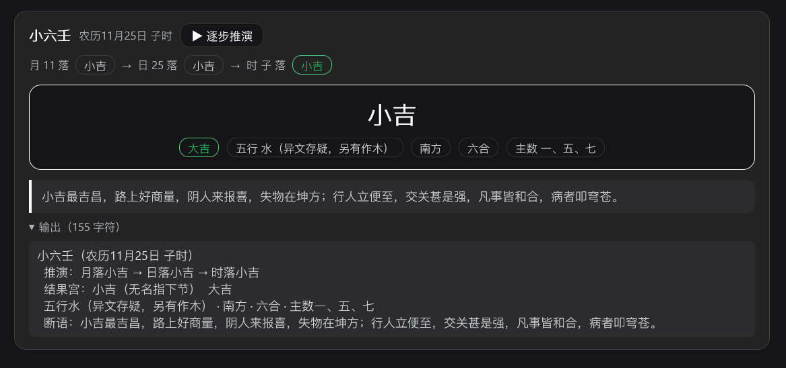

### 6.4 综合分析（fortune_comprehensive）

**改版后全貌**（`145539`）：共识热力矩阵（流派×五行，中文标签）→ 指标说明行（覆盖度/方向一致）→ 各维度卡带**覆盖度 + 方向一致双徽章** → **旺衰卡五行条形图**（结构化 scores 渲染）→ 冲突清单。

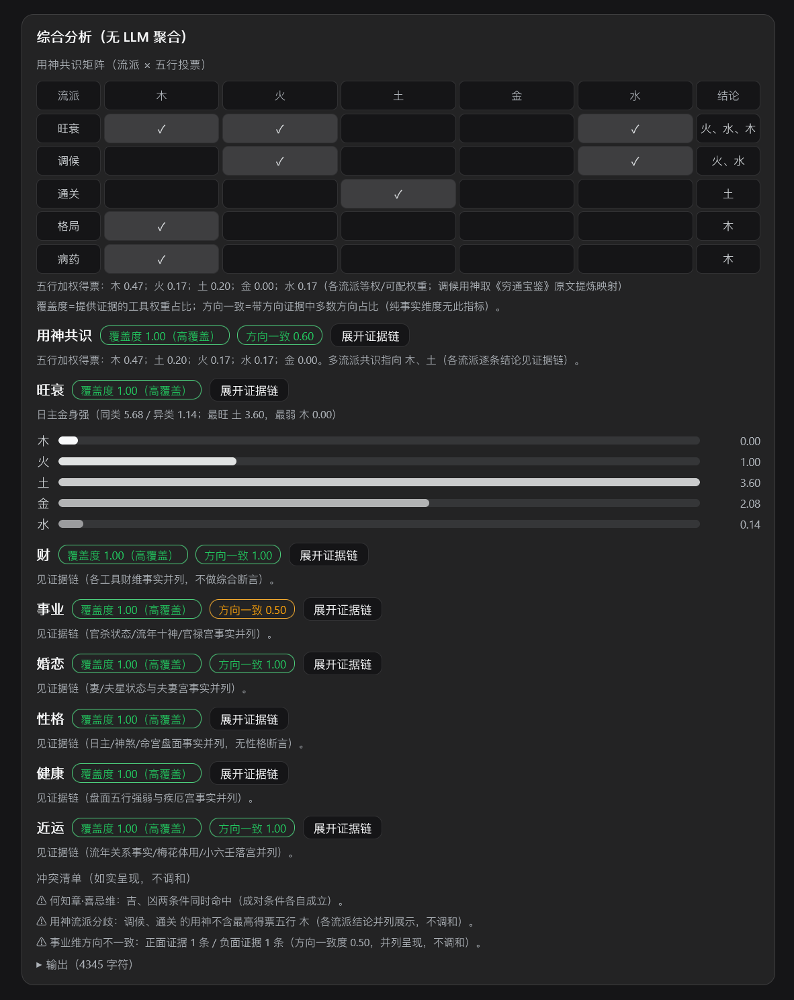

**证据链展开细节**（`142310`，改版前截图）：每条证据渲染为**结构化条目卡**——工具徽章（色档区分：八字绿/称骨绿/紫微蓝/六爻黄…）+ 字段行（流派中文）+ 事实正文 + 出处脚注；旧版徽章文字为「共识度（强共识）」，现已更新为「覆盖度 · 方向一致」。

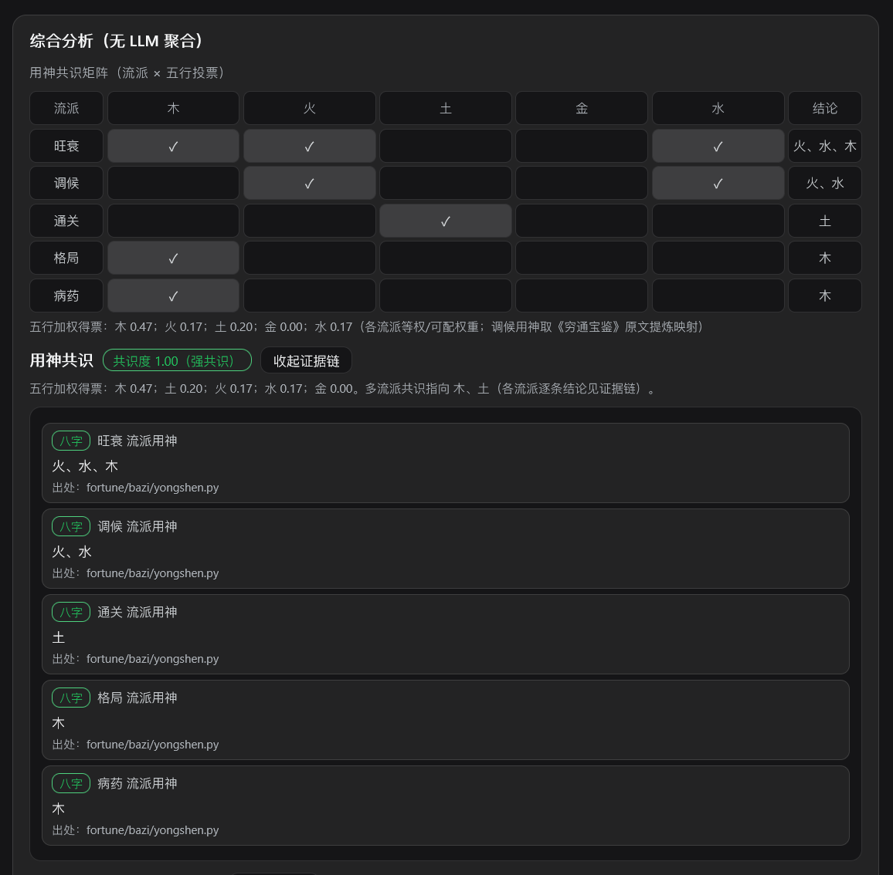

> 其余截图（历法速查、神煞页签、事业/婚恋/性格/健康/近运证据链、冲突清单细项）见 `pic/` 目录，版面与上述同类，不再重复收录。
