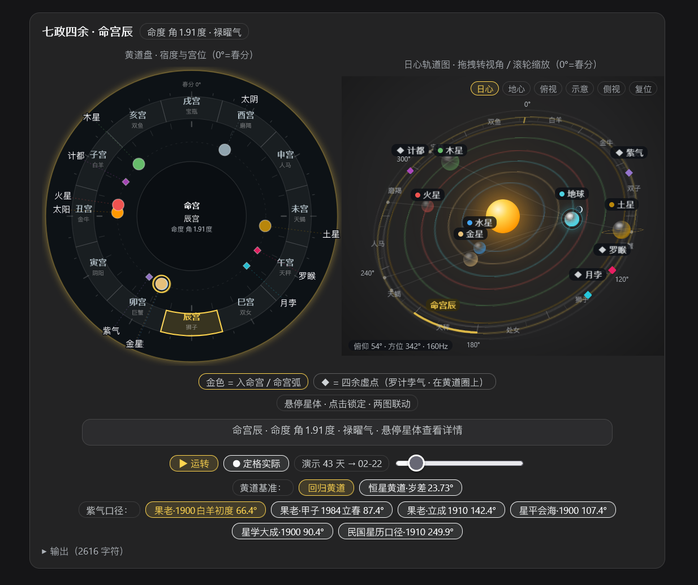
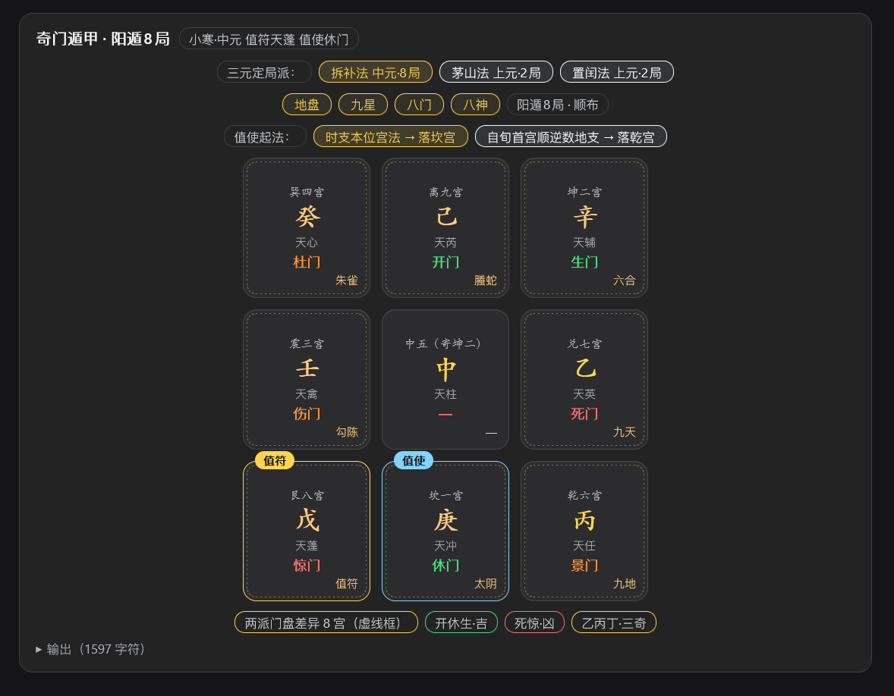
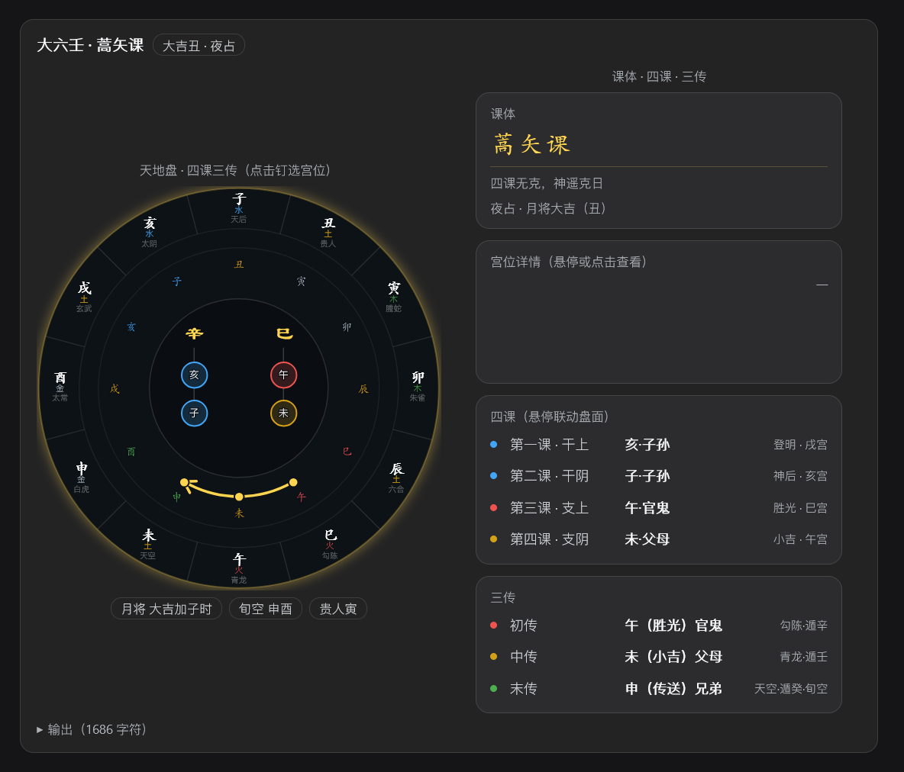
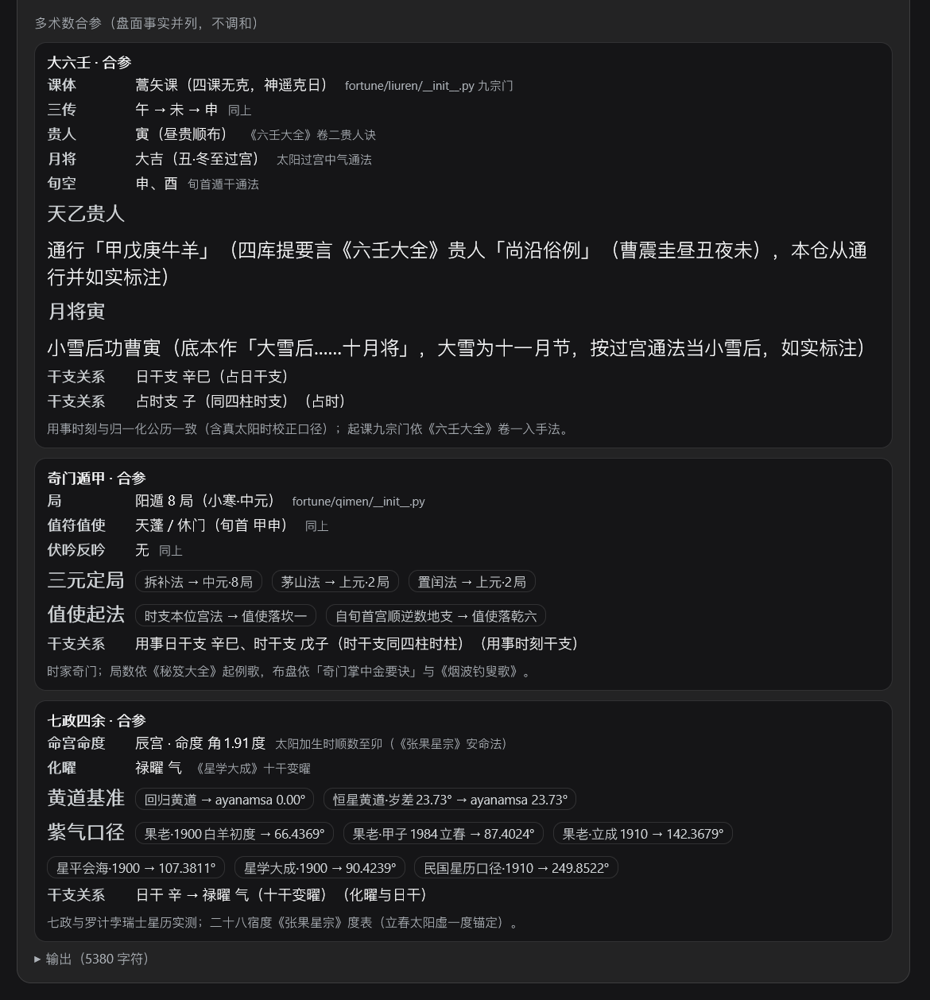

# dsh-fortune-client —— fortune 工具的图形化 Web UI（DSH 客户端插件）

为 `dsh-fortune` 的工具注册 `tool.call.toolview` 行渲染，把排盘结果画成
直观的**可交互**图形化盘面，带入场/脉冲/描画/生长动效：

| 工具 | 图形化呈现 | 交互 |
|---|---|---|
| `fortune_bazi` | 四柱卡片（日主高亮）+ 五行旺衰动画条 + 大运/神煞/合冲刑害徽章 + **用神多流派子页签**（旺衰/调候/通关/格局/病药）+ **何知章 4 维成对条** + **大运流年时间轴**（冲突年描边、点年看事实）+ **口径分段器**（真太阳时/钟表时，后端预计算切换） | **页签切换**；点四柱卡看藏干十神；点流年年份看关系事实；切换时辰口径 |
| `fortune_ziwei` | **紫微十二宫盘 SVG**：逐宫绽放、命宫呼吸脉冲、四化着色、大限标注、格局徽章 + **格局复核**（星曜实际落宫/破格提示）+ **解读速览**（--interpret，检索式） | 点宫位弹星曜详情；悬停高亮对宫；键盘 Enter/Space |
| `fortune_liuyao` | 六爻卦象：爻线描画、动爻脉冲、世应标记、纳甲徽章 + **占题用神聚焦卡**（topic/date 徽章） | 点爻看六亲/六神释义 |
| `fortune_meihua` | 本卦/互卦/变卦三卡 + 体用五行徽章 + 吉凶着色断语 + 口径徽章 | 点卦卡看爻位/先天数/五行 |
| `fortune_chenggu` | 年月日时骨重卡 + 总骨重弹入 + 判词 + 口径徽章 | 点骨重卡；↻ 重播动效 |
| `fortune_xiaoliuren` | 月→日→时三步推演路径 + 结果宫大卡 + 断语 + 口径徽章 | ▶ 逐步推演重放 |
| `fortune_solar_info` | 公历/农历/年干支/四柱徽章 + 节气时间徽章 | — |
| `fortune_context` | BirthContext：四柱徽章 + 钟表/校正时支双口径 + 归一化步骤 | — |
| `fortune_comprehensive` | **用神共识热力矩阵**（流派×五行投票）+ **分维度结论卡**（共识度分档徽章）+ **证据链折叠**（工具→字段→事实→出处）+ **冲突清单** + **多术数合参卡**（大六壬/奇门遁甲/七政四余：关键标志+流派对照+干支关系，可用 `include` 裁剪） | 证据链展开/收起按钮；合参卡悬停 chips 看出处注 |
| `fortune_liuren` | **式盘**（平面发光描边）：外环地支宫（刻度式，楷体，hover 金描边）+ 五行色字 + 天将小字（同锚点竖直对齐，底部五宫特殊处理）+ 天盘神六亲色楷体环 + 三传金弧（节点依次点亮/末传箭头）+ **中央四课形体**（干/支隶书 + 连线描画）+ 右侧课体/宫位详情/四课/三传卡（详情卡固定高度防抖） | 悬停/点击宫位钉选联动；四课/三传行悬停同步盘面；三传节点 hover 放大 |
| `fortune_qimen` | **洛书九宫盘**：宫名/地盘干楷体、四层开关（地盘干/九星/八门/八神）、值符（金）/值使（蓝）标签弹入、伏吟/反吟徽章；**多流派并算切换**：三元定局三派（拆补/茅山/置闰·超神接气）+ 值使起法两派（时支本位宫/自旬首宫顺逆数地支），切换全盘波浪重扫 + **两派差异虚线框** + 差异宫数徽章 | 四层开关；流派按钮组（悬停显示口径注）；差异宫位提示 |
| `fortune_qizheng` | **左黄道盘 + 右双模式轨道图**：左盘平面发光描边（宿度/宫位楷体/四余◆虚点/盘外读数标签随星平滑移动）；右图日心轨道（视位黄经准线、月相、黄道带±5°、行星明度）/地心黄道天球，可俯仰缩放转台相机、**屏幕空间球体**（恒为正圆+深度排序遮挡）、命宫金弧、`follow` 相机读数（含实测 Hz）；**黄道基准双口径**（回归/恒星黄道·岁差修正）+ 紫气六口径 | 悬停/点击锁定联动；拖拽视角/滚轮缩放；▶运转/⏺定格+进度滑块+绝对日期 |

## 数据链路

```
dsh-fortune（宿主）--execute--> python -m fortune.cli ... --meta-json <tmp>
        │（同步 spawn）
        └--presentationMeta--> 读取 <tmp> JSON → 持久化 block.meta
dsh-fortune-client（浏览器）--tool.call.toolview 槽位--> 读 block.meta 渲染
```

- 结构化数据的单一事实源仍是 Python 侧（fortune.cli `--meta-json`）；
- canonical 文本输出照常供模型阅读，UI 只消费 meta 投影；
- meta 缺失（旧日志重放）时优雅回退纯文本。

## 设计约束

- 零颜色字面量：全部 `--dsw-alias-*` 语义 token，暗色主题自动适配；
- `prefers-reduced-motion` 时全量关闭动效（推演按钮直接全显）；
- 键盘可达：页签/宫位/爻/卦卡均可用 Tab 聚焦、Enter/Space 激活，
  `aria-pressed`/`aria-selected`/`role=tablist|button|img` 标注；
- 交互状态（选中宫/爻/页签）为纯前端 React state，不改动会话数据。

### 三术成品（2026 年内多轮迭代的终版形态）

- **大六壬式盘 v2.0**：六壬断课的"式盘"观感——平面发光描边、十二宫刻度式
  （非饼图态）、地支/五行/天将三行同锚点竖直对齐（底部五宫特殊外移处理）、
  天盘神六亲色楷体环、三传金弧（节点/**初→中→末依次点亮**、末传箭头）、
  **中央四课形体**（干/支隶书大字 + 六亲色节点 + 连线描画）、右侧课体/宫位详情
  （固定高度槽防抖）/四课/三传卡，盘课双向联动；
- **七政四余 v1.1**：左黄道盘（平面发光）+ 右**双模式**图（日心轨道：视位黄经
  准线/月相/黄道带/行星明度；地心黄道天球），可俯仰缩放转台相机；
  **天体球改为屏幕空间渲染**（恒为正圆、深度排序遮挡、近大远小透视缩放，根治
  浏览器 CSS 3D 的椭圆失真）；**黄道基准双口径**（回归/恒星黄道·岁差修正）与
  紫气六口径可切换，全盘随口径同步旋转；相机读数含实测刷新率（60/120/144Hz）；
- **奇门九宫**：宫名/地盘干楷体、三奇金色、值符（金）/值使（蓝）弹入标签、
  全盘波浪重扫；**多流派并算**：三元定局三派（拆补/茅山/置闰·超神接气）+
  值使起法两派（时支本位宫/自旬首宫顺逆数地支），差异宫位金色虚线框 +
  「两派门盘差异 N 宫」徽章；
- **综合分析·多术数合参**：六壬/奇门/七政 三卡并列（关键标志+流派对照 chips+
  与四柱干支关系），跨体系不投票不调和，`include` 参数可裁剪。

## 测试

```powershell
node test\smoke.mjs   # 渲染冒烟：注入假 react/window，12 视图渲染 + 交互回调
                      # + 12 宫盘结构 + 三大新盘（天地盘/九宫/星盘）+ meta 缺失回退
```

## 安装

```powershell
dsh plugin --profile web add link:path-to-fortune-assistant/plugin-client
# 无需 cordis.patch.yml 配置（无 config 项）；重启 DSH + 刷新页面生效
```

`dsh.client.immediately=true`：客户端模块随页面启动即加载（toolview 槽位注册不依赖
惰性触发）；宿主侧 bundle 有 watcher 时改动会自动重建（rev 变化），刷新页面即可。

## 效果截图（实机渲染，`../pic/` 目录）

八字四柱卡 + **口径分段器**（真太阳时/钟表时，后端预计算切换）与八大页签：


用神页签——**多流派中文子页签** + 用/忌徽章；
何知章页签——**4 维成对条**；流年页签——**大运流年时间轴**（冲突年描边、点年看事实）：


紫微十二宫盘（点宫看详情）+ 格局复核 + 解读速览（--interpret）：


综合分析（无 LLM 聚合）——共识热力矩阵（中文流派）+ **覆盖度/方向一致双徽章** + 旺衰五行条形图 + 冲突清单：


称骨 / 梅花 / 小六壬视图：


综合分析与三大新盘（2026-09-06 终版实机截图，`../pic/` 目录）：

七政四余 v1.1 —— 左黄道盘 + 右日心轨道图（视位准线/月相/黄道带）、
黄道基准双口径（回归/恒星黄道·岁差 23.73°）与紫气六口径切换、
相机读数含实测刷新率：


奇门遁甲 —— 九宫盘 + 三元定局三派（拆补/茅山/置闰）与值使起法两派切换、
两派差异虚线框（此盘 8 宫不同）、值符/值使弹入标签：


大六壬式盘 v2.0 —— 四课形体居中（干/支隶书 + 六亲色节点）、三传金弧依次点亮、
右列课体/详情/四课/三传卡（悬停联动不抖动）：


综合分析·多术数合参 —— 六壬/奇门/七政三卡并列（关键标志 + 流派对照 chips +
干支关系），跨体系不投票不调和：


> 全部实机截图见 `fortune-assistant/pic/`；详细槽位与数据契约见 `docs/ui_contract.md` §6。
